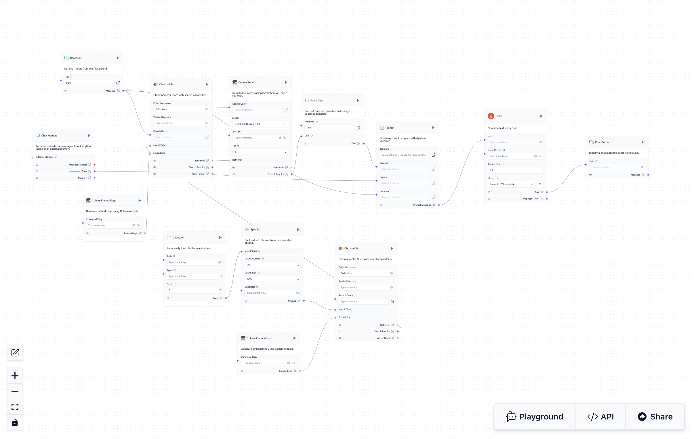

# AI Customer Support, for telecom company use Langflow
This chatbot uses groq and is trained with the most frequent questions asked by customers.You can also use it locally with Ollama or using OpenAI.
# Install dependency
>1. Python = 3.10 or latest
>2. Langflow = 1.0.19
>3. PIP3 = latest

# Install Langflow
Install Langflow with pip:
>python -m pip install langflow -U

Install Langflow with pipx:
>pipx install langflow --python python3.10 --fetch-missing-python

If you have problems to install langflow please checking this link: https://docs.langflow.org/getting-started-installation

# Advertisement!!!
This chatbot is in Romanian and Russian languages to change languages changed the promt instruction.

# How it’s work?
Langflow is a new, visual framework for building multi-agent and RAG applications. It is open-source, Python-powered, fully customizable, LLM and vector store agnostic.

Its intuitive interface allows for easy manipulation of AI building blocks, enabling developers to quickly prototype and turn their ideas into powerful, real-world solutions.

This image shows the structure of the chatbot
we have:
1. Chat input
2. Promise
3. AI Model (I use groq with llama, you can use whatever you want)
4. ChromaDB
5. Cohere
6. Chat Output 

# The figure above below shows an example of how it works

# How to use

